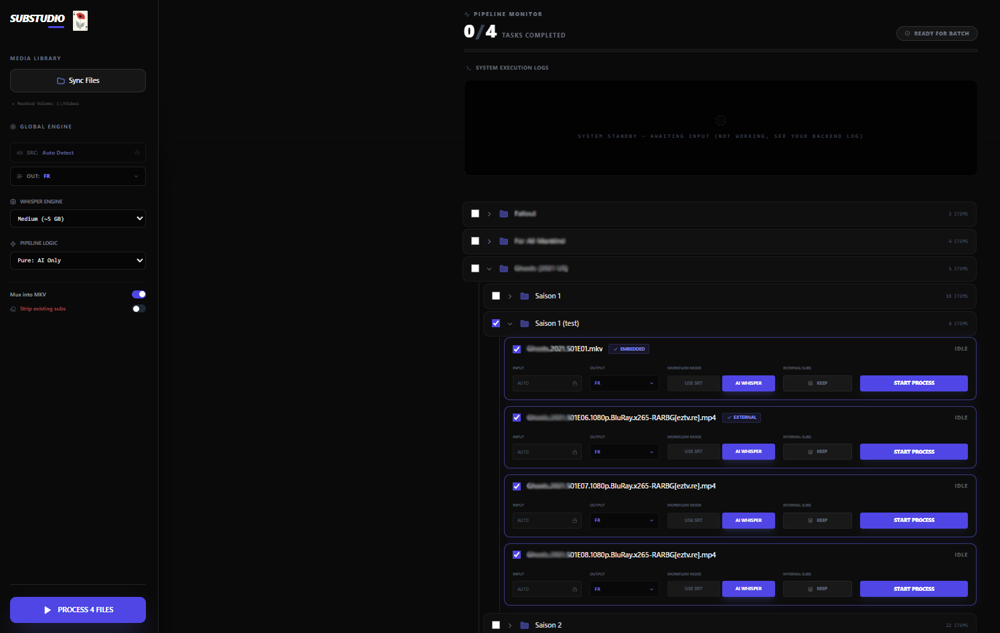

# 🎬 SubStudio: Local Processing Studio
SubStudio is a professional-grade, AI-powered media pipeline designed for automated subtitle generation, context-aware translation, and intelligent MKV muxing. By leveraging local Whisper models and LLM intelligence, it transforms raw video files into fully accessible, multi-lingual media without ever leaving your local network.

<p align="center">
  
</p>

## 🚀 Key Features
AI Transcription: Powered by OpenAI's Whisper (Tiny to Large models).

* **AI Transcription:** Powered by OpenAI’s **Faster-Whisper** engine. Features a custom **+0.4s synchronization offset** to compensate for audio onset latency, ensuring perfect visual alignment.
* **Intelligent Muxing:** A custom FFmpeg engine that preserves original internal streams while injecting new AI-generated tracks with proper **ISO 639-2** language tags and descriptive titles.
* **Contextual Translation:** LLM-based translation logic that maintains narrative consistency across subtitle segments, avoiding the "stilted" feel of traditional line-by-line translation.
* **Real-time Orchestration:** A decoupled architecture using **Server-Sent Events (SSE)** for frame-accurate progress tracking and live "Execution Terminal" logs.
* **External Subtitle Discovery:** Automatically scans for and incorporates existing sidecar `.srt` files during the muxing process.

## 🏗️ Architecture & Communication
SubStudio operates on a decoupled Client-Server model optimized for high-throughput media processing.

* **Frontend (Next.js 14):** A React-based "Studio" dashboard utilizing a centralized `StudioContext` for state management.
* **Backend (FastAPI):** A high-performance Python server handling AI inference and FFmpeg manipulation.
* **Server-Sent Events (SSE):** Provides a real-time stream from backend to frontend for progress percentages (20% to 100%), status changes, and terminal logs.
* **Shared Volume:** Both services mount a shared `/data` volume. The backend performs **in-place processing**, minimizing I/O overhead by avoiding unnecessary file copies.

## 📡 API Contracts & Data Formats
1. Folder Discovery (GET /scan)
The backend performs a recursive walk of the /data directory. It identifies video files and checks for both internal (embedded) and external (sidecar) subtitles.

Response Schema:

JSON
{
  "files": [
    {
      "fileName": "movie.mp4",
      "filePath": "/data/movies/movie.mp4",
      "is_directory": false,
      "subtitleInfo": {
        "hasSubtitles": true,
        "subType": "mixed", 
        "languages": ["eng", "fra"],
        "count": 2
      }
    }
  ]
}
2. Processing Pipeline (POST /process)
Starts the sequence: Audio Extraction ➔ Whisper Transcription (+0.4s) ➔ AI Translation ➔ MKV Muxing.

## 🛠️ Technical Deep Dive
The Transcriber (Whisper)
Our transcription engine applies a fixed 0.4-second positive offset to all generated timestamps. This compensates for the natural latency between audio onset and Whisper's segment detection, resulting in subtitles that feel "snappier" and perfectly synchronized with human speech.

The Muxer (FFmpeg)
To avoid the common "Piste 1" naming bug in media players, our muxer bypasses standard library wrappers to inject raw metadata:

Preservation: Maps 0:v, 0:a, and all 0:s (original tracks).

Injection: Adds generated tracks as new streams.

Tagging: Explicitly sets -metadata:s:X language=fra and -metadata:s:X title="AI French".

## 🚦 Getting Started

Follow these steps to deploy SubStudio on your local machine using Docker.

### 1. Environment Configuration
Configure the `.env` file in the project root. This file bridges your local media folders with the containerized pipeline.

```env
# AI Credentials
OPENAI_API_KEY=your_key_here

# Media Path (Point this to your local video library)
NEXT_PUBLIC_MEDIA_PATH=C:/Videos
```

### 2. Launch the Pipeline
SubStudio uses a decoupled architecture. Docker Compose will automatically build the Next.js frontend and the FastAPI/Whisper backend.

```bash
docker-compose up --build
```

### 3. Access the Studio
Once the containers are healthy, the dashboard will be available at:
👉 http://localhost:3000
Note: On the first run, the backend will download the Whisper model (e.g., Medium) to the internal cache. This may take a few minutes depending on your internet speed.

## ⚖️ License
Distributed under the MIT License. See LICENSE for more information.

## 📂 Project Structure
backend/core/events.py muxer.py scanner.py subtitle_processor.py transcriber.py translator.py main.py

```text
# SubStudio Project Structure

.
├── backend/
│   ├── core/
│   │   ├── events.py
│   │   ├── muxer.py
│   │   ├── scanner.py
│   │   ├── subtitle_processor.py
│   │   ├── transcriber.py
│   │   ├── translator.py
│   │   └── __init__.py
│   ├── Dockerfile
│   ├── main.py
│   └── requirements.txt
├── data/                      # Shared media volume
├── frontend/
│   ├── src/
│   │   ├── app/
│   │   │   ├── globals.css
│   │   │   ├── layout.tsx
│   │   │   └── page.tsx
│   │   ├── components/
│   │   │   ├── dashboard/
│   │   │   │   ├── GlobalProgress.tsx
│   │   │   │   ├── SubImportModal.tsx
│   │   │   │   ├── videoCard.tsx
│   │   │   │   └── VideoList.tsx
│   │   │   └── layout/
│   │   │       └── Sidebar.tsx
│   │   ├── lib/
│   │   │   ├── api.ts
│   │   │   ├── sse.ts
│   │   │   └── types.ts
│   │   ├── public/
│   │   │   └── logo.png
│   ├── Dockerfile
│   ├── next-env.d.ts
│   ├── package.json
│   ├── postcss.config.js
│   ├── tailwind.config.ts
│   └── tsconfig.json
├── ressources/
│   └── logo.png               # Brand Assets
├── .env                       # Environment Variables
├── .gitignore
├── docker-compose.yml         # Orchestration
├── readme.md
```